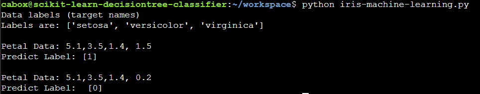

# Machine Learning Basics: Decision Tree Classifier

>Machine Learning: demo a decision tree model to classify a dataset of Iris flowers.
>-Reviews an iris dataset of petal dimensions and classify the species of iris.

- Fundamental concepts in machine learning
- Supervised versus Unsupervised learning
- Machine learning frameworks
- Machine learning using Python and scikit-learn


## Dependencies

- Python (>= 2.7 or >= 3.4),
- NumPy (>= 1.8.2),
- SciPy (>= 0.13.3)
- scikit-learn
- Iris Flower Dataset (included with scikit-learn)

## Setup

- Clone repo
- Install scikit-learn and all dependencies: `pip install -U scikit-learn[alldeps]`
- For Anaconda Python users, load the "environmental.yml" file for dependencies.
- run, `python iris-machine-learning`


<p align="center">
  
</p>
<p>The model classifies the first data as label "1" (species Iris versicolor) and the second as label "0" (Iris setosa)</p>


## Notes

- A classifier looks at a piece of data and trys to classify it.
- DecisionTreeClassifier "is a class capable of performing multi-class classification on a dataset."
- The "Iris Flower Data Set" is commonly used to test machine learning
- The classifier often produces different results each time it is run.
  - This is because it uses probalistic behavior by randomly chooses a feature that might make the best comparison
- Load the dataset, then write the classifier.
```python
from sklearn.datasets import load_iris      # Load iris flower dataset
iris = load_iris()  #assign dataset to a variable
print(list(iris.target_names))    #print labels (target names)
```
- Use the decision tree model to classify the dataset
```python
classifier = tree.DecisionTreeClassifier()      # Build a classifier
```
- **Supervised Learning:**  Machine intelligence uses models to predicat a category or quantity.
- **Unsupervised Learning:** A computer analyzes unlabeled data and attempts to recognize patterns.Unsupervised
- An **example** is a single element in a dataset.
- A **feature** is one characteristic of an example.

### Review/Kata

- Write code to create a classifier.
- Write code to load the iris flower dataset.


## Sources

- [Machine Learning Basics](https://teamtreehouse.com/library/machine-learning-basics)
- [scikit-learn.org](https://scikit-learn.org/stable/)
- [Wikipedia: Machine Learning](https://en.wikipedia.org/wiki/Machine_learning)
- [Docs: Classification](https://scikit-learn.org/stable/modules/tree.html#classification)
- [Docs: sklearn.tree.DecisionTreeClassifier](https://scikit-learn.org/stable/modules/generated/sklearn.tree.DecisionTreeClassifier.html#sklearn.tree.DecisionTreeClassifier)
- [Introduction to Anaconda](https://teamtreehouse.com/library/introduction-to-anaconda)
- [Wikipedia Iris Flower Data Set](https://en.wikipedia.org/wiki/Iris_flower_data_set)
- [Docs: load_iris()](https://scikit-learn.org/stable/modules/generated/sklearn.datasets.load_iris.html#sklearn.datasets.load_iris)
- [Docs: fit()](https://scikit-learn.org/stable/modules/generated/sklearn.tree.DecisionTreeClassifier.html#sklearn.tree.DecisionTreeClassifier.fit)


